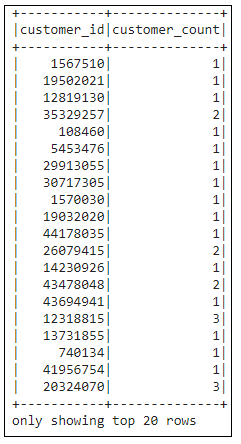
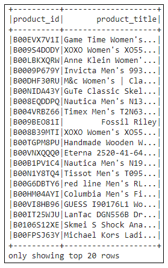
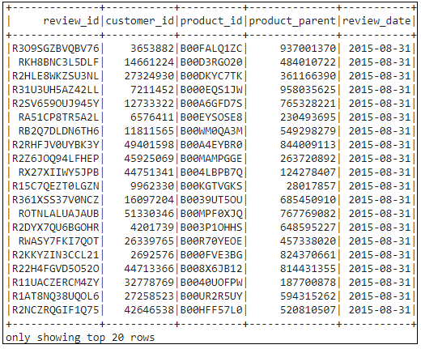
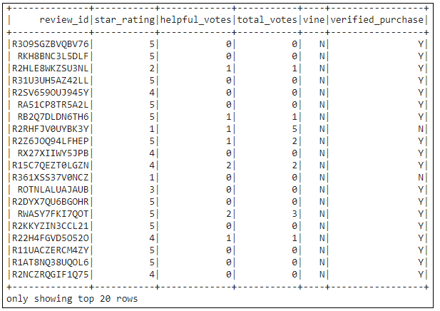
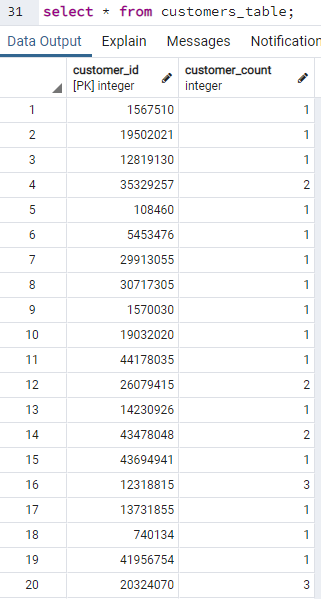
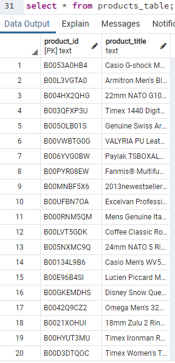
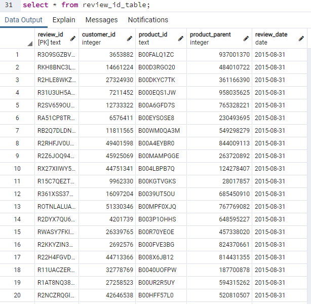
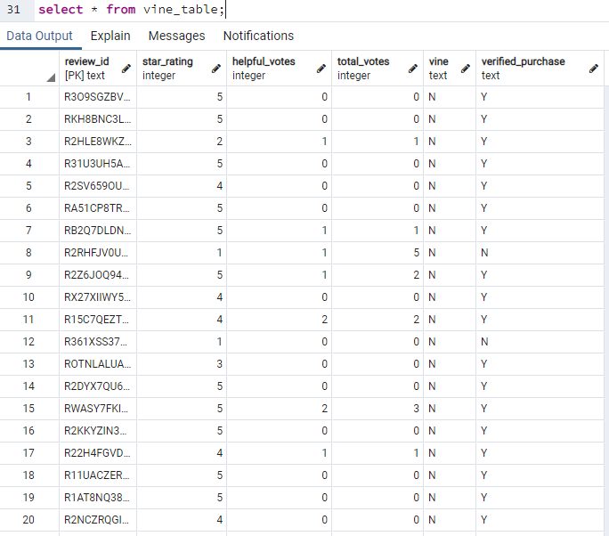
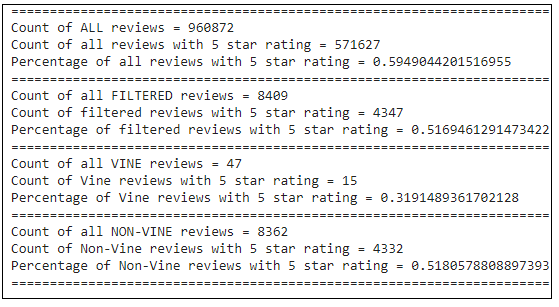

# Amazon Vine Analysis

## Overview
I am the first data expert at **BigMarket**, a startup that helps businesses optiomize their markting efforts, and I have been hired just in time too. One of BigMarket's clients has requested some pretty hefty analytics. The client **$ellby** is about to release a large catalog of products on a leading retail website. They want to kow how the review of their products compares to the reviews of competitor products sold by their competitors. They are also interested in enrolling in a program that gives out free products to select reviewers but they want to know if it worth the cost. There are thousands of reviews and they are in words not numbers so you"ll have to translate them in order to analyze them. $ellby hired BigMarket because they believe in the power of big data. 

For this project I'll be partnering with Jennifer, an account manager at BigMarket. SellBy, my client, loves to talk about the power of big data, but Jennifer isn't a data expert. So I will do the heavy lifting.
## Purpose of this Analysis
As a part of our first assignment, Jennifer and I did a NLP analysis of the reviews and when the model was tested, it gave a accuracy rate of almost 70%. The client **$ellby** was impressed.

I have now been tasked with another, larger project: analyzing Amazon reviews written by members of the paid Amazon Vine program. The Amazon Vine program is a service that allows manufacturers and publishers to receive reviews for their products. Companies like SellBy pay a small fee to Amazon and provide products to Amazon Vine members, who are then required to publish a review.

In this project, I will have to use PySpark to perform the ETL process to extract the dataset, transform the data, connect to an AWS RDS instance, and load the transformed data into pgAdmin. Next, I'll use PySpark to determine if there is any bias toward favorable reviews from Vine members in your dataset. 

## Resources
* Software/Tools: Google Colab, AWS RDS, Visual Studio Code (v1.49.2), PgAdmin
* Language(s): PySpark, SQL 
* Data Source(s): https://s3.amazonaws.com/amazon-reviews-pds/tsv/amazon_reviews_us_Watches_v1_00.tsv.gz

## Output on Google Colab

1) DataFrame - amazon_reviews_us_Watches

    

2) DataFrame - customers_df

    

3) DataFrame - products_df

    

4) DataFrame - review_id

    

5) DataFrame - vine_df

    

## PostgreSQL Query output

1) SQL query - customers_table

    

2) SQL query - products_table

    

3) SQL query - review_id_table

    

4) SQL query - vine_table

    

## Results

### Answers to the questions

#### Question 1: How many Vine reviews and non-Vine reviews were there?
* Total number of Vine reviews: 47
* Total number of non-Vine reviews: 8362

#### Question 2: How many Vine reviews were 5 stars? How many non-Vine reviews were 5 stars?
* Vine reviews that were 5 stars - 15
* non-Vine reviews that were 5 stars - 4332

#### Question 3: What percentage of Vine reviews were 5 stars? What percentage of non-Vine reviews were 5 stars?
* Percentage of Vine reviews that were 5 stars: 31.91%
* Percentage of non-Vine reviews that were 5 stars: 51.81%

## Summary
I do not believe that there is any positivity bias for the reviews in the Vine program. On the contrary, the percentage of 5-star ratings by vine reviewers (31.91) is less than the percentage of 5-star ratings by non-vine reviewers (51.81). 

One of the reasons behind this could be that vine users are those Amazon users, who have been specially selected by amazon for their past honest review history. These reviewers tend to post honest (postive as well as negative) reviews.

### Additional analysis
* In this analysis, we filtered the data according to some conditions - this resulted in decreasing the sample size - we could do an anlysis or Vine and Non-Vine reviews without any filters.
* We can run other stastical analysis, like the one-sample t-test to see if this difference can be contributed to chance.
* There are a total of 46 US Reviews Datasets on the page https://s3.amazonaws.com/amazon-reviews-pds/tsv/index.txt. We could combine other datasets to the current one to increase our sample size and thus can get relatively better results.
* We could also run a two-sample t-test using 2 differnt datasets from the list.
